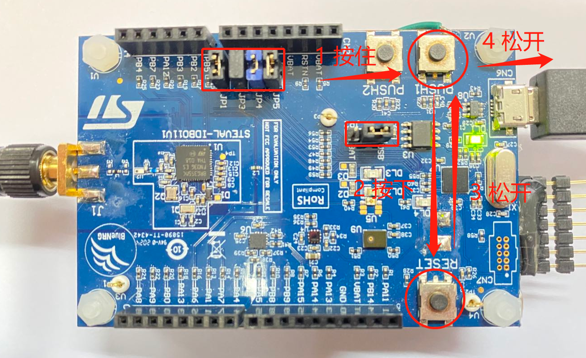

##### 芯片上电后的启动步骤如下：

1. 芯片上电（或复位）后，芯片内部的 ROM 代码会先运行，

2. 当检测到 PA10 脚为低电平时，会直接跑进 FLASH 开始运行用户固件。

3. 当检测到 PA10 脚为高电平时，会运行 UART BOOTLOADER 流程。

4. UART BOOTLOADER 可通过串口接收用户指令，执行一系列的操作。其特性为
   - 自动检测波特率，范围：500 – 460800  
   - 只能在指定的引脚：UART RX = PA8，UART TX = PA9
   - 用户需要先以某个波特率给 BLUENRG-LP 发送 0x7F，当接收到 0x79 的回复时，说明成功进入 UART BOOTLOADER 流程，可开始发送指令

> UART BOOTLOADER 详细的介绍，参照文档：AN5471: The BlueNRG-LP UART bootloader protocol
>
> https://www.st.com/content/ccc/resource/technical/document/application_note/group1/1d/95/10/36/0e/47/45/13/DM00693040/files/DM00693040.pdf/jcr:content/translations/en.DM00693040.pdf

5. 和 UART BOOTLOADER 握手成功后，用户便可以通过 UART 接口给芯片下载固件
6. 同时，由于 UART BOOTLOADER 也使能了芯片的 JTAG 接口，用户也可以在这种模式下，使用 JTAG 接口给芯片下载固件

##### 操作开发板使 Bluenrg-lp 进入 UART BOOTLOADER 模式

将开发板连接到 PC，并检查下开发板上的跳帽是否配置为如下图所示：

然后，让芯片进入 BOOT 模式。主要有四步（注意，进行这一步操作的时候，手不要太快，一步步来）：

- 按住 PUSH1 按键，不要松开
- 按下 RESET 按键
- 松开 RESET 按键
- 松开 PUSH1 按键

如图：

> 注意
>
> 若上面的操作不成功，可按住 PUSH1 按键，然后重新拔->等一秒->插 USB 线

