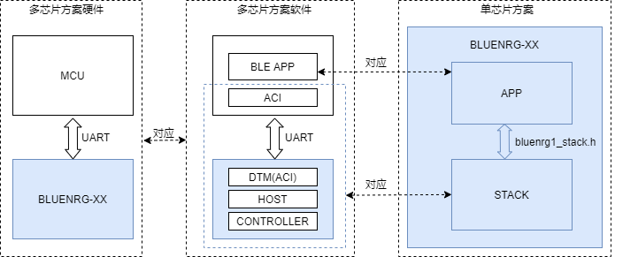

#### 引言

ACI 指令的应用场景：

目前市面上的 BLE 产品还是以单芯片方案为主，即芯片厂商提供包含蓝牙功能的 SOC 和对应的 SDK，用户在此 SDK 的基础上进行 BLE 应用层的开发。而且协议栈一般都打包成库，以接口的形式提供给应用层。如上图的第三个方框所示。

而有些 BLE 产品是多芯片方案的，如智能手表，会以一颗比较强大的 MCU 作为主控，再外接一个蓝牙模块（或协处理器）实现蓝牙功能。ST 为该场景下的蓝牙部分的实现提供了强大、灵活的支持。

上图中间方框中的蓝色方框部分，对应了单芯片方案中的协议栈的部分；该部分包含两个固件：

- 运行在 BLE 芯片上的 DTM 固件（SDK->Project\BLE_Examples\DTM）
- 运行在 MCU 上的应用例程固件（SDK->Project\STM32L）

DTM 固件封装了蓝牙标准 HCI 接口并进行了扩展，可通过 UART 、SPI 接口和外部 MCU 通讯。

MCU 上的应用例程和 DTM 固件对接，并为上层用户提供了类似于单芯片方案中的协议栈接口。用户可像开发单芯片方案一样，进行 MCU 上的 BLE APP 层面的开发。

这样的层次架构带来一个巨大的好处：在固件适配方面，用户可以以最小的代价，在单芯片方案、多芯片方案中进行硬件置换。

当我们把上图中的 MCU 换成 PC 时：

看下图，有个几个名词：HCI, ACI, DTM, GUI tool。

HCI 是蓝牙核心规范定义的一个接口规范，通过该接口规范，我们可以控制 BLE 控制器做一些事情。

ACI 是 ST 的 BLE SDK 定义的一个接口规范。ACI 是对 HCI 的引用和扩展。

DTM 是 ST 的 BLE SDK 提供的一个固件工程；主要实现了 ACI 接口。

BlueNRG GUI Tool 是和 DTM 固件配合的一个图形化的上位机工具；简化用户对 ACI 指令的应用。

本文的讲题是 HCI、ACI 指令的应用，希望能够讲清楚 ACI、HCI 指令是如何实现一些常用的 BLE 流程的，如连接、广播、GATT 读和写等。对于 BLE 的应用开发者来说，了解 HCI、ACI 指令的应用，有助于加深对 BLE 核心规范的了解；加强 BLE 核心规范的开发的 debug 能力。

BlueNRG GUI Tool 工具简化了用户对 HCI、ACI 指令的应用难度，用户不需要去了解指令的具体数据结构，可更专注于指令的功能、指令实现的流程的学习、开发。**本文用 GUI 来指代 BlueNRG GUI Tool**

#### 完备开发环境

文本所用到的资料、开发软、硬件工具，列举如下：

- 蓝牙核心规范一份：[《Core_v5.2.pdf》](https://www.bluetooth.org/docman/handlers/downloaddoc.ashx?doc_id=478726)
- ST BLE 芯片平台相关资料：[BlueNRG-LP](https://www.st.com/content/st_com/en/products/wireless-transceivers-mcus-and-modules/bluetooth-bluetooth-low-energy/bluenrg-lp.html#documentation)，可从该网站页面找到协议栈编程指南：[《PM0269》](https://www.st.com/resource/en/programming_manual/dm00698052-bluetooth-le-stack-v3x-programming-guidelines-stmicroelectronics.pdf)
- BlueNRG-LP SDK 下载页面：[stsw-bnrglp-dk](https://www.st.com/content/st_com/en/products/embedded-software/evaluation-tool-software/stsw-bnrglp-dk.html)
- BlueNRG-LP GUI 工具下载页面：[stsw-bnrgui](https://www.st.com/content/st_com/en/products/embedded-software/wireless-connectivity-software/stsw-bnrgui.html)
- BlueNRG-LP 开发板，下载开发板的应用资料：[《UM2735》](https://www.st.com/resource/en/user_manual/dm00711446-bluenrglp-development-kits-stmicroelectronics.pdf)
- 手机 APP。iOS, LightBlue； Android, nRF connect (推荐用安卓系统，能看到比较多的参数)

#### 快速进行一次 GUI 工具的应用

本小节介绍怎么用 GUI 工具给开发板发送指令，使其发出广播。

一、准备硬件

将开发板连接到 PC，并检查下开发板上的跳帽是否配置为如下图所示：

然后，让芯片进入 BOOT 模式。主要由四步（注意，进行这一步操作的时候，手不要太快，一步步来）：

- 按住 PUSH1 按键，不要松开
- 按下 RESET 按键
- 松开 RESET 按键
- 松开 PUSH1 按键

如图：

> 开始下载固件前，需要让 BLUENRG-LP 进入 BOOT 模式。进入 BOOT 模式的原理是，芯片在上电或者复位（RESET按键）的时候，会先检测 PA10 引脚（PUSH1 按键）的电平，如果是高电平，则进入 BOOT 模式，否则正常引导、运行用户固件。
>
> 若上面的操作不成功，可按住 PUSH1 按键，然后重新拔->等一秒->插 USB 线

二、下载 DTM 固件

安装完 SDK 开发环境（SDK 开发环境是一个 exe 文件）后，会有一个 Navigator 工具：

找到：Demonstration Application -> BLE demonstration & test applications -> 下一页按钮 -> DTM -> UART 页面，然后按 Flash & Run：

完成之后，按复位按键，使 DTM 固件运行起来

三、GUI 工具

打开 GUI 工具，见下图，点击框 1 的 OPEN，便可看到框 3 中 GUI 工具和开发板之间进行了几条指令交互：

-> HCI_READ_LOCAL_VERSION_INFORMATION

<- HCI_COMMAND_COMPLETE_EVENT

-> ACI_HAL_GET_FIRMWARE_DETAILS

<- HCI_COMMAND_COMPLETE_EVENT

框 2 把指令接收到的版本信息显示了出来。

切到 Beacon 选项卡，

在 Address 处设置下蓝牙地址，如 123456789AAA，

在 TX Power Level 处设置下发射功率，如 0，

然后点击 Set Beacon

可在上图的框 3 中看到瞬间一堆指令完成了交互，并以 Job finished 结尾。

此时，开发板应该是已经发出了 Beacon 广播了。

验证时，我们可打开手机 APP（Android nRF connect），可找到一个 Beacon 设备，

其蓝牙地址为：12:34:56:78:9A:AA。如图：

#### HCI、ACI 指令的应用场景

####  