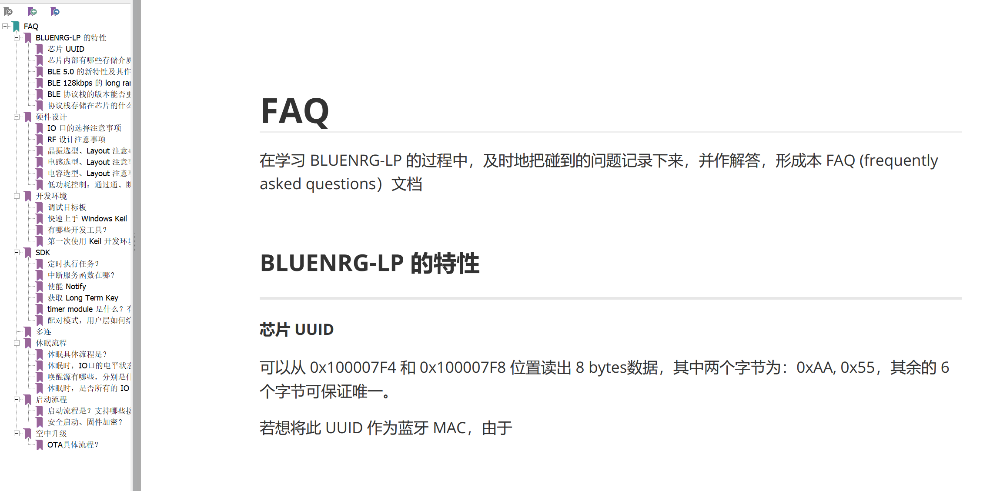
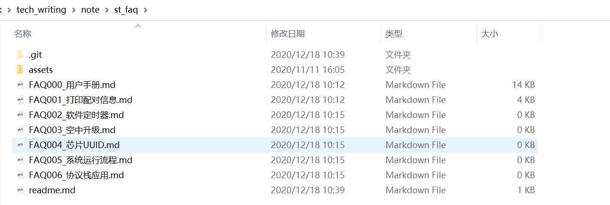
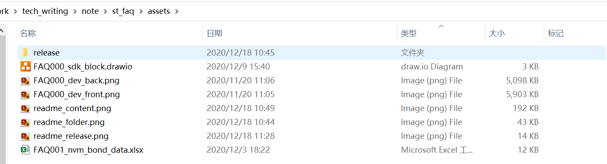
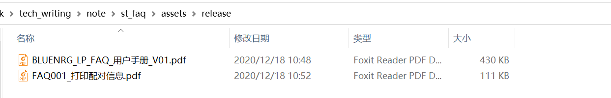

# README

#### 目的、思路

编写 FAQ 相关文档的主要目的，在于让用户能够快速的了解 ST 的 BLUENRG-LP 平台。编写的内容应该力求全面、易读性高和注重实操，具体如下：

##### 全面

内容上应该尽量地涵盖用户可能会问到的问题。问题可非常的细小，比如，BLUENRG-LP 支不支持蓝牙5.0？开发环境是什么？等问题。回答时，也可以简单的回答，“支持，且协议栈可升级”，"Keil，IAR 都支持"，这样类似的方式。

为了方便索引，建议将所有的 FAQ 都放在一份文档里，命名为《FAQ 用户手册》；另外为了限制篇幅、避免文档过大，手册里的 FAQ 的解答应该尽量简短。有限的篇幅内无法解释清楚问题的，我们可以在该问题下贴一个链接，引导用户到另外的专门的 FAQ 文档里做进一步了解，文件形式如下图所示：

##### 易读性

易读性，主要体现在客户能够直接、快速的得到自己想要的答案，目前想到可从这几方面入手：

* 问题归类。如下图所示

  

* 直接、简单的回答。回答应该简单直接，比如，用户在阅读 SDK 代码时，碰到 HAL_VTIMER_Tick 这个函数、不清楚它是什么。我们可以一句话概括其功能和应用，然后再贴上链接，引导用户到一份专门的文档做进一步的了解

* 编辑规范。好的行文规范，能在视觉上让用户清晰明了。具体约束、在后文细说

##### 注重实操

对于一些需要实际操作的问题，应该尽量详尽、以图文的形式展现给用户。一般这种问题，可在用户手册里简单说下实操思路，再在另外一个文档中进行详细的步骤描述。

#### 规范

FAQ 相关文档，分为编辑状态和发布状态。编辑状态以 markdown 书写，markdown 引用到的各类资源，都存放在同级的 assets 目录下。发布时，转化为 PDF 文档，发布的文档都存放在 assets 目录的 release 目录下。

详情如下：

##### 编辑规范

编辑规范如下图所示：

要求：

markdown 格式书写

命名名规范（文档名、目录名、图表名等），markdown 文章的命名格式如上图所示，markdown 引用的资源的文件名要加上前缀，如下图所示：

文章内容规范（版本、作者、版权等）

版本维护（通过 git 工具等）

##### 发布规范

发布规范如下图所示：

要求：

将发布的文档统一放在 assets 目录的 release 目录下

以PDF的格式发布，后续考虑用 WIKI？

用户手册的命名需要加上版本号

FAQ 问题文档（如上图 FAQ001）和编辑时的 markdown 文档同名即可

